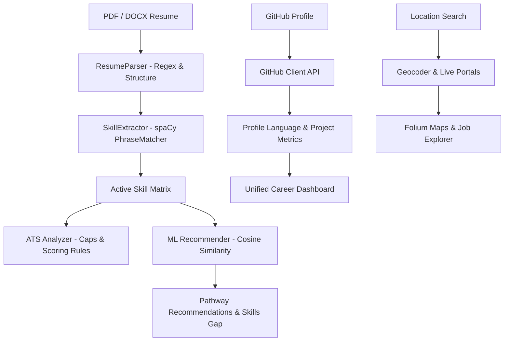

# 🧭 CareerCompass AI

[](https://www.python.org/)
[](https://streamlit.io/)
[](https://spacy.io/)
[](https://huggingface.co/sentence-transformers)
[](https://www.sqlite.org/)

**CareerCompass AI** is an advanced, recruiter-grade AI career development and ATS (Applicant Tracking System) optimization portal. The platform empowers job seekers by analyzing their resumes, scoring them against real-world recruitment standards, highlighting skill gaps, suggesting tailored career pathways, pulling live job markets on interactive maps, and generating customized educational roadmaps.

---

## 🚀 Key Features

### 1. 🔍 ATS Resume Analyzer
- **Segmented Parser**: Extracts contact details, education, work experience, projects, and achievements.
- **Strict Scoring Engine**: Scores resumes dynamically out of 100 based on quantifiable metrics, action verbs, cliches, and formatting layout guidelines. Capped strictly at 78% if no target job description is provided to simulate professional standard software behavior.
- **Visual Gaps & Formatting Checks**: Identifies style issues, font problems, contact header omissions, and lists missing vs matched keywords using beautiful Plotly visualizations.

### 2. 💼 AI-Driven Career Recommendations
- **Deep Resume Analysis**: Scans the technical skills section and parses the projects section in detail to extract active competencies.
- **Cosine Similarity Matching**: Uses Sentence-Transformers (`all-MiniLM-L6-v2`) to run semantic matching against dynamic market roles.
- **Origin Tagging**: Visualizes matched skills on recommendations cards, showing exactly where in the resume they matched (e.g. `React (Skills)` or `Python (Skills+Projects)`).

### 3. 🗺️ Job Market Explorer & Interactive Map
- **Live Search Redirection**: Directs users straight to LinkedIn/Indeed portals based on location.
- **Interactive Map**: Geocodes search locations and plots matching companies and coordinates using Folium map layers.
- **Dynamic fallbacks**: Deterministically rotates high-fidelity mock jobs when API keys are absent, ensuring unique company and coordinate variations per page.

### 4. 🐙 GitHub Portfolio Analyzer
- **Repository Profiling**: Evaluates public repository codebases, language distribution, and contributions.
- **Project Extraction**: Integrates projects dynamically into the user's dashboard profile.

---

## 🛠️ Technology Stack

- **Frontend / UI**: [Streamlit](https://streamlit.io/) with customized high-fidelity CSS styling, transitions, glassmorphic cards, and Plotly graphics.
- **Natural Language Processing**: [spaCy](https://spacy.io/) (`en_core_web_sm`) PhraseMatcher for taxonomy-based keyword extraction.
- **Machine Learning**: [Sentence-Transformers](https://sbert.net/) (`all-MiniLM-L6-v2`) for semantic embedding similarity vector matches.
- **Database**: [SQLite3](https://www.sqlite.org/) for storing user records, parsed resume metadata, saved jobs, and career path insights.
- **Maps**: [Folium](https://python-visualization.github.io/folium/) / [Streamlit-Folium](https://github.com/randyzwitch/streamlit-folium) for interactive geographical mapping.

---

## 📐 Technical Architecture



---

## 📦 Installation & Setup

Follow these steps to run CareerCompass AI locally on your system:

### 1. Clone the Repository
```bash
git clone https://github.com/Dprasad17/CarrerCompass-AI.git
cd CarrerCompass-AI
```

### 2. Set Up a Virtual Environment
```bash
# Windows
python -m venv venv
venv\Scripts\activate

# macOS/Linux
python3 -m venv venv
source venv/bin/activate
```

### 3. Install Dependencies
```bash
pip install -r requirements.txt
python -m spacy download en_core_web_sm
```

### 4. Configure Environment Variables
Create a `.env` file in the root directory:
```env
DB_PATH=data/careercompass.db

# Optional APIs
ADZUNA_APP_ID=your_adzuna_app_id
ADZUNA_APP_KEY=your_adzuna_app_key
GITHUB_TOKEN=your_personal_github_access_token
```

### 5. Initialize the Database
```bash
python database/init_db.py
```

### 6. Run the Application
```bash
streamlit run app.py
```

---

## 🎯 Recruiter & Professional Highlights

- **Production-grade Caching**: Features resource/data caching (`@st.cache_resource` / `@st.cache_data`) for heavy NLP models and web services, ensuring sub-second UI hot-reloads and transitions.
- **Clean DB Schema**: Normalization structure with foreign keys, check constraints, and thread-safe SQLite connection manager pooling.
- **High-Performance Multi-Threading**: Offloads heavy model loads on startup onto background daemon threads, avoiding blank startup screens.
- **Geocoding Thread safety**: Features a thread-safe geocoder caching helper to prevent UI lag on search location updates.
- **Modern Responsive Design System**: Completely custom-styled UI (`assets/css/custom.css`) for premium dark-mode visuals, typography overrides, and custom UI components.
