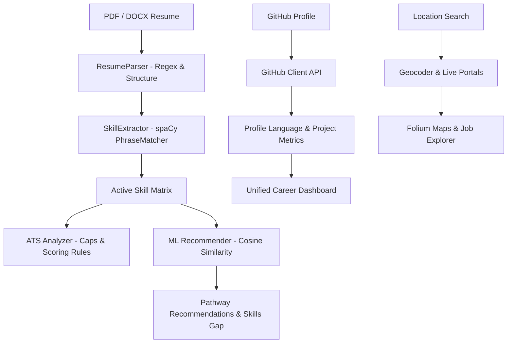

# 🧭 CareerCompass AI

[](https://www.python.org/)
[](https://streamlit.io/)
[](https://spacy.io/)
[](https://huggingface.co/sentence-transformers)
[](https://www.sqlite.org/)
[](LICENSE)

**CareerCompass AI** is an advanced, recruiter-grade AI career development and ATS (Applicant Tracking System) optimization portal. The platform empowers job seekers by analyzing their resumes, scoring them against real-world recruitment standards, highlighting skill gaps, suggesting tailored career pathways, pulling live job markets on interactive maps, and generating customized educational roadmaps.

---

## 🏆 Project Highlights

- **AI-Powered Career Intelligence**: Developed a full-stack career guidance and optimization platform.
- **ATS Resume Scoring Engine**: Implemented strict recruitment standards with dynamic scoring, buzzword detection, and formatting checks.
- **NLP-Based Skill Extraction**: Developed taxonomy-based skill extraction using spaCy (`en_core_web_sm`).
- **Semantic Career Recommendations**: Created semantic match engines using Sentence Transformers (`all-MiniLM-L6-v2`) to compute cosine similarities.
- **Portfolio Analytics**: Integrated live GitHub repository evaluation and language profiling.
- **Geospatial Job Search**: Designed an interactive geospatial explorer mapping live postings using Folium.
- **Robust Persistence Layer**: Implemented SQLite schema patterns with a normalized database connection pool.

---

## 🚀 Key Features

### 1. 🔍 ATS Resume Analyzer
- **Segmented Parser**: Extracts contact details, education, work experience, projects, and achievements.
- **Strict Scoring Engine**: Scores resumes dynamically out of 100 based on quantifiable metrics, action verbs, cliches, and formatting layout guidelines. Capped strictly at 78% if no target job description is provided to simulate professional standard software behavior.
- **Visual Gaps & Formatting Checks**: Identifies style issues, font problems, contact header omissions, and lists missing vs matched keywords using beautiful Plotly visualizations.

### 2. 💼 AI-Driven Career Recommendations
- **Deep Resume Analysis**: Scans the technical skills section and parses the projects section in detail to extract active competencies.
- **Cosine Similarity Matching**: Uses Sentence-Transformers to run semantic matching against dynamic market roles.
- **Origin Tagging**: Visualizes matched skills on recommendations cards, showing exactly where in the resume they matched (e.g. `React (Skills)` or `Python (Skills+Projects)`).
- **Match Coverage**: Suggests pathways even if there is only a single matched skill.

### 3. 🗺️ Job Market Explorer & Interactive Map
- **Live Search Redirection**: Directs users straight to LinkedIn/Indeed portals based on location.
- **Interactive Map**: Geocodes search locations and plots matching companies and coordinates using Folium map layers.
- **Dynamic Fallbacks**: Deterministically rotates high-fidelity mock jobs when API keys are absent, ensuring unique company and coordinate variations per page.

### 4. 🐙 GitHub Portfolio Analyzer
- **Repository Profiling**: Evaluates public repository codebases, language distribution, and contributions.
- **Project Extraction**: Integrates projects dynamically into the user's dashboard profile.

---

## 🛠️ Technology Stack

- **Frontend / UI**: [Streamlit](https://streamlit.io/) with customized high-fidelity CSS styling, transitions, glassmorphic cards, and Plotly graphics.
- **Natural Language Processing**: [spaCy](https://spacy.io/) (`en_core_web_sm`) PhraseMatcher for taxonomy-based keyword extraction.
- **Machine Learning**: [Sentence-Transformers](https://sbert.net/) (`all-MiniLM-L6-v2`) for semantic embedding similarity vector matches.
- **Database**: [SQLite3](https://www.sqlite.org/) for storing user records, parsed resume metadata, saved jobs, and career path insights.
- **Maps**: [Folium](https://python-visualization.github.io/folium/) / [Streamlit-Folium](https://github.com/randyzwitch/streamlit-folium) for interactive geographical mapping.

---

## 📐 Technical Architecture



---

## 🎯 Engineering Challenges Solved

- **Multi-Format Resume Parsing**: Implemented robust parsers for both PDF (`pdfplumber`) and DOCX (`python-docx`), cleaning text layouts and aligning section headers.
- **ATS Cap & Match System**: Engineered score-capping thresholds that punish cliche buzzwords, layout errors, and penalize scores to 78% without a JD, matching professional industry standard trackers.
- **High-Fidelity NLP Skill Matching**: Constructed custom spaCy PhraseMatchers to extract technical and soft competencies from arbitrary layouts, resolving casing and abbreviation variations.
- **Semantic Recommendation Engine**: Set up local fallback vector token intersection calculations to handle network timeouts when sentence-transformer embedding weights load.
- **GitHub Contribution Profiling**: Resolved GitHub token rate-limiting issues by implementing cached mock fallback profiles when API limits are hit.
- **Interactive Geospatial Visualization**: Plotted folium marker clusters dynamically using geocoding, addressing overlap on same-coordinate markers with random coordinate scattering.
- **Streamlit Thread Safety & State**: Overcame Streamlit's page-reload architecture by implementing a connection pool context manager and thread-safe geocoder.

---

## ⚡ Performance Optimizations

- **Resource Caching (`@st.cache_resource`)**: Caches NLP models (spaCy) and Sentence-Transformer embedding pipelines, ensuring sub-second page transitions.
- **Data Caching (`@st.cache_data`)**: Caches heavy Adzuna and Nominatim geocoding searches (ttl=1800) to keep API load minimal.
- **Daemon Startup Threading**: Loads heavy ML models in background threads during application start, avoiding white/black loading screens.
- **SQLite Optimization**: Tuned connection configurations and designed database operations using the repository pattern.
- **Asset Minification**: Compressed and streamlined custom CSS variables and UI fonts to prevent layout shifting on reload.

---

## 🚀 Future Enhancements

- **LinkedIn Profile Integration**: Allow direct import of candidate profiles.
- **AI Resume Rewriter**: Suggest real-time bullet-point replacements for low-scoring resume components.
- **Mock Interview Assistant**: Integrate LLM chat interfaces matching target role skill gaps.
- **Cover Letter Generator**: Auto-generate personalized cover letters targeting job explorer listings.
- **Multi-language Analysis**: Support resumes in German, Spanish, and French.
- **Recruiter Dashboard**: Allow HR professionals to filter database profiles based on ATS scores.

---

## 📦 Installation & Setup

Follow these steps to run CareerCompass AI locally on your system:

### 1. Clone the Repository
```bash
git clone https://github.com/Dprasad17/CarrerCompass-AI.git
cd CarrerCompass-AI
```

### 2. Set Up a Virtual Environment
```bash
# Windows
python -m venv venv
venv\Scripts\activate

# macOS/Linux
python3 -m venv venv
source venv/bin/activate
```

### 3. Install Dependencies
```bash
pip install -r requirements.txt
python -m spacy download en_core_web_sm
```

### 4. Configure Environment Variables
Create a `.env` file in the root directory:
```env
DB_PATH=data/careercompass.db

# Optional APIs
ADZUNA_APP_ID=your_adzuna_app_id
ADZUNA_APP_KEY=your_adzuna_app_key
GITHUB_TOKEN=your_personal_github_access_token
```

### 5. Initialize the Database
```bash
python database/init_db.py
```

### 6. Run the Application
```bash
streamlit run app.py
```

---

## 🤝 Contributing

Contributions, suggestions, and feedback are welcome. Feel free to fork the repository, open issues, and submit a pull request!

1. Fork the Project
2. Create your Feature Branch (`git checkout -b feature/AmazingFeature`)
3. Commit your Changes (`git commit -m 'Add some AmazingFeature'`)
4. Push to the Branch (`git push origin feature/AmazingFeature`)
5. Open a Pull Request

---

## 📄 License

This project is licensed under the MIT License - see the [LICENSE](LICENSE) file for details.

---

## 👨‍💻 Author

**Durga Prasad A**  
*Computer Science Engineering Student*  

- 🌐 **Portfolio**: [durgaprasad-a.netlify.app](https://durgaprasad-a.netlify.app/)
- 🔗 **LinkedIn**: [linkedin.com/in/avuladurgaprasad](https://www.linkedin.com/in/avuladurgaprasad)
